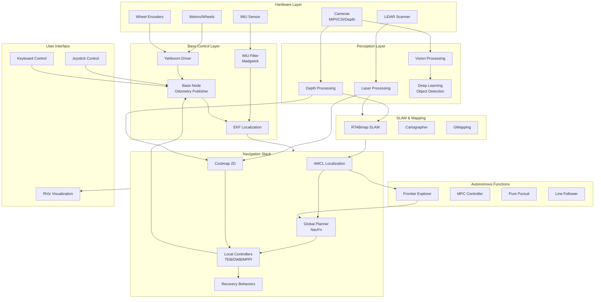
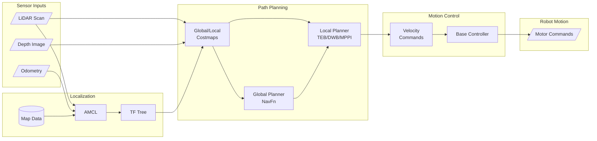
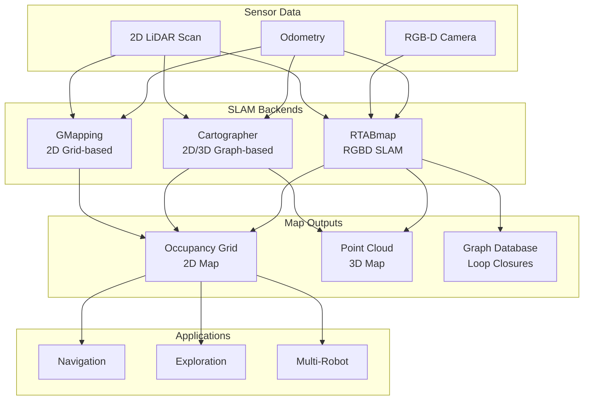
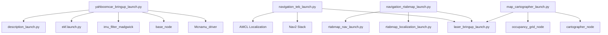
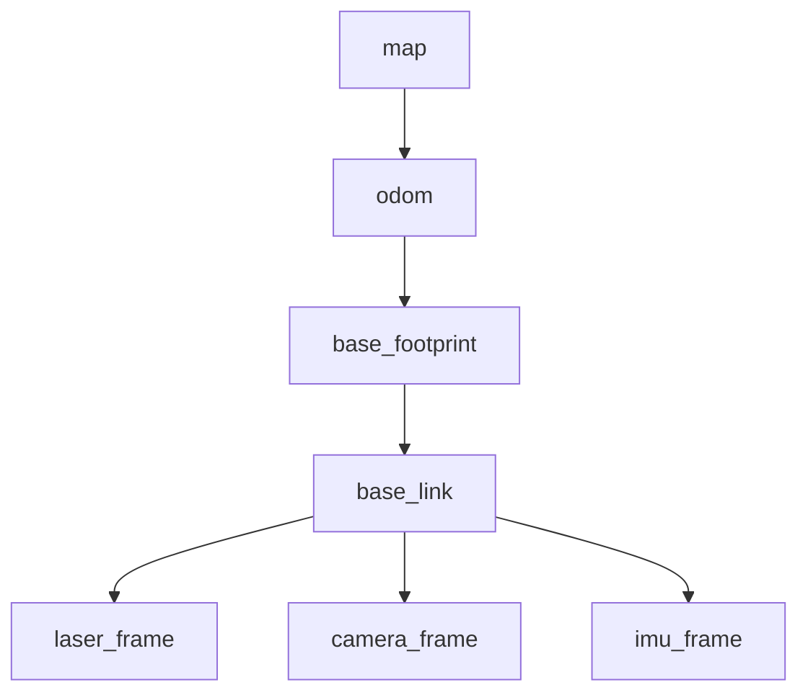

# Robot 3 - Yahboom Robot Car ROS2 Workspace

## Engineering Documentation

[](https://docs.ros.org)
[]()

## Table of Contents
- [Project Overview](#project-overview)
- [System Architecture](#system-architecture)
- [Package Structure](#package-structure)
- [Hardware Specifications](#hardware-specifications)
- [Installation & Setup](#installation--setup)
- [Launch Files](#launch-files)
- [Development Guide](#development-guide)

---

## Project Overview

### Purpose
This ROS2 workspace provides a complete robotic navigation and perception stack for the Yahboom robot car platform. The project enables:

- **Autonomous Navigation**: Multiple path planning algorithms (TEB, DWB, MPPI)
- **SLAM & Mapping**: Support for RTABmap, Cartographer, and GMapping
- **Autonomous Exploration**: Frontier-based exploration for unknown environments
- **Computer Vision**: Deep learning-based object detection, tracking, and perception
- **Multi-Robot Coordination**: Distributed navigation and mapping
- **Teleoperation**: Joystick and keyboard control interfaces

### Key Features
- 🗺️ Multiple SLAM backends (2D/3D mapping)
- 🤖 Autonomous frontier exploration
- 📷 Multi-camera support (MIPI, CSI, Depth cameras)
- 🧠 Deep learning integration (object detection, gesture control)
- 🎯 Advanced path planning (MPC, Pure Pursuit)
- 👥 Multi-robot coordination support
- 🎮 Multiple teleoperation modes

---

## System Architecture

### High-Level System Diagram



### Navigation Stack Data Flow



### SLAM Ecosystem



---

## Package Structure

### Complete Package Table

| Package Name | Type | Purpose | Key Dependencies |
|-------------|------|---------|-----------------|
| **yahboomcar_base_node** | C++ | Low-level motor control, odometry publishing, wheel encoder integration | rclcpp, geometry_msgs, nav_msgs, tf2 |
| **yahboomcar_bringup** | Python | Main launch files for robot startup, sensor fusion (EKF), IMU filtering | robot_localization, imu_filter_madgwick |
| **yahboomcar_description** | Python | URDF robot models, mesh files, robot state publisher | urdf, robot_state_publisher |
| **yahboomcar_nav** | Python | Navigation stack with multiple planners (TEB, DWB, MPPI), SLAM integration | nav2, rtabmap, cartographer |
| **yahboomcar_autonomous** | C++ | Autonomous driving (MPC, Pure Pursuit), waypoint following | qpoases, ament_cmake |
| **yahboomcar_multi** | Python | Multi-robot navigation, distributed AMCL, coordinated mapping | nav2_bringup |
| **yahboomcar_ctrl** | Python | Teleoperation (joystick, keyboard), manual control interfaces | joy, teleop_twist_keyboard |
| **yahboomcar_laser** | Python | LiDAR data processing, scan filtering | sensor_msgs |
| **yahboomcar_visual** | Python | Visual servoing, image processing pipelines | cv_bridge, OpenCV |
| **yahboomcar_astra** | Python | Astra depth camera integration, point cloud processing | astra_camera |
| **yahboomcar_colortrack** | Python | Color-based object tracking, visual following | OpenCV, cv_bridge |
| **yahboomcar_linefollower** | Python | Line detection and following algorithms | OpenCV |
| **yahboomcar_kcftracker** | C++ | KCF (Kernelized Correlation Filters) object tracking | OpenCV, rclcpp |
| **yahboomcar_msgs** | C++ | Custom message definitions for robot-specific data | rosidl |
| **yahboom_app_save_map** | Python | Map saving utilities, map server integration | nav2_map_server |
| **yahboom_web_savmap_interfaces** | C++ | Web interface for map management | rosidl |
| **Autonomous-Explorer-and-Mapper-ros2-nav2** | Python | Frontier-based autonomous exploration | nav2, numpy |
| **slam_gmapping** | C++ | GMapping SLAM wrapper for ROS2 | openslam_gmapping |
| **openslam_gmapping** | C++ | OpenSLAM GMapping library | - |
| **robot_pose_publisher_ros2** | C++ | Pose publishing utilities | geometry_msgs, tf2 |
| **laserscan_to_point_publisher** | Python | LaserScan to PointCloud2 conversion | sensor_msgs |
| **mipi_camera_simple** | Python | MIPI camera driver and publisher | camera_info_manager |
| **yahboomcar_csi_cam_py** | Python | CSI camera driver and publisher | cv_bridge |
| **yahboomcar_deeplearning** | Python | Deep learning modules (object detection, gesture control, body tracking) | PyTorch/TensorFlow, OpenCV |

### Directory Structure

```
Robot 3/
├── src/
│   ├── yahboomcar_base_node/          # Core motor control
│   ├── yahboomcar_bringup/            # Main system launcher
│   ├── yahboomcar_description/        # Robot models (URDF)
│   ├── yahboomcar_nav/                # Navigation & SLAM
│   │   ├── launch/                    # Navigation launch files
│   │   ├── params/                    # Controller parameters
│   │   │   ├── teb_nav_params.yaml
│   │   │   ├── dwb_nav_params.yaml
│   │   │   ├── mppi_nav_params.yaml
│   │   │   └── cartographer_config.lua
│   │   ├── maps/                      # Saved maps
│   │   └── rviz/                      # RViz configs
│   ├── yahboomcar_autonomous/         # Autonomous algorithms
│   │   ├── MPC/                       # Model Predictive Control
│   │   ├── Purepursuit/               # Pure Pursuit controller
│   │   └── waypoints/                 # Waypoint data
│   ├── yahboomcar_multi/              # Multi-robot support
│   │   ├── launch/                    # Multi-robot launches
│   │   └── param/                     # Per-robot parameters
│   ├── yahboomcar_ctrl/               # Teleoperation
│   ├── yahboomcar_laser/              # LiDAR processing
│   ├── yahboomcar_visual/             # Vision processing
│   ├── yahboomcar_astra/              # Depth camera
│   ├── yahboomcar_colortrack/         # Color tracking
│   ├── yahboomcar_linefollower/       # Line following
│   ├── yahboomcar_kcftracker/         # Object tracking
│   ├── yahboomcar_deeplearning/       # Deep learning
│   │   ├── object_detection/
│   │   ├── gesture_control/
│   │   ├── body_tracking/
│   │   └── line_follower_perception/
│   ├── Autonomous-Explorer-and-Mapper-ros2-nav2/  # Frontier exploration
│   ├── slam_gmapping/                 # GMapping SLAM
│   ├── openslam_gmapping/             # GMapping library
│   └── [other packages...]
└── README.md                          # This file
```

---

## Hardware Specifications

### Robot Platform: Yahboom Robot Car

| Component | Specification |
|-----------|--------------|
| **Robot Type** | Differential Drive Mobile Robot |
| **Robot Radius** | 0.1 m (circular footprint) |
| **Max Linear Velocity** | 0.26 m/s |
| **Max Angular Velocity** | 1.0 rad/s |
| **Linear Acceleration Limit** | 2.5 m/s² |
| **Angular Acceleration Limit** | 3.2 rad/s² |
| **Base Frame** | `base_footprint` |
| **Coordinate Frames** | `map` → `odom` → `base_footprint` → `base_link` |

### Sensor Suite

| Sensor | Purpose | Topic |
|--------|---------|-------|
| **2D LiDAR** | Obstacle detection, SLAM | `/scan` |
| **IMU** | Orientation, angular velocity | `/imu/data` |
| **Wheel Encoders** | Odometry | `/odom` |
| **RGB-D Camera** (Intel RealSense R200) | Depth perception, 3D mapping | `/intel_realsense_r200_depth/points` |
| **Astra Camera** | Alternative depth sensor | `/camera/*` |
| **MIPI/CSI Cameras** | Visual perception, tracking | `/camera/image_raw` |

---

## Installation & Setup

### Prerequisites

```bash
# ROS2 (Humble or Foxy)
# Ubuntu 20.04/22.04
# Python 3.8+
```

### Dependencies

```bash
# Install ROS2 packages
sudo apt install ros-${ROS_DISTRO}-navigation2 \
                 ros-${ROS_DISTRO}-nav2-bringup \
                 ros-${ROS_DISTRO}-slam-toolbox \
                 ros-${ROS_DISTRO}-rtabmap-ros \
                 ros-${ROS_DISTRO}-robot-localization \
                 ros-${ROS_DISTRO}-imu-filter-madgwick \
                 ros-${ROS_DISTRO}-joy \
                 ros-${ROS_DISTRO}-teleop-twist-keyboard

# Install Python dependencies
pip install numpy opencv-python
```

### Build Workspace

```bash
cd ~/Robot\ 3/
colcon build --symlink-install
source install/setup.bash
```

---

## Launch Files

### Quick Start Launches

#### 1. Basic Robot Startup

```bash
# Start robot base, sensors, and odometry
ros2 launch yahboomcar_bringup yahboomcar_bringup_launch.py
```

#### 2. SLAM & Mapping

```bash
# Option A: Cartographer SLAM
ros2 launch yahboomcar_nav cartographer_launch.py

# Option B: GMapping SLAM
ros2 launch yahboomcar_nav map_gmapping_launch.py

# Option C: RTABmap SLAM (RGB-D)
ros2 launch yahboomcar_nav map_rtabmap_launch.py
```

#### 3. Navigation (with existing map)

```bash
# Option A: TEB Local Planner
ros2 launch yahboomcar_nav navigation_teb_launch.py

# Option B: DWB Local Planner
ros2 launch yahboomcar_nav navigation_dwb_launch.py

# Option C: RTABmap Navigation
ros2 launch yahboomcar_nav navigation_rtabmap_launch.py
```

#### 4. Autonomous Exploration

```bash
# First, start navigation
ros2 launch yahboomcar_nav navigation_teb_launch.py

# Then start explorer (in new terminal)
ros2 run custom_explorer explorer
```

#### 5. Multi-Robot System

```bash
# Launch multi-robot navigation
ros2 launch yahboomcar_multi nav2_multi.launch.xml
```

#### 6. Teleoperation

```bash
# Joystick control
ros2 launch yahboomcar_ctrl yahboomcar_joy_launch.py

# Keyboard control
ros2 run yahboomcar_ctrl yahboom_keyboard
```

### Launch File Hierarchy



---

## Development Guide

### Navigation Controller Configuration

The system supports three local planners, each with different characteristics:

| Planner | Best For | Configuration File |
|---------|----------|-------------------|
| **TEB** | Dynamic obstacles, smooth trajectories | `teb_nav_params.yaml` |
| **DWB** | Fast replanning, differential drive | `dwb_nav_params.yaml` |
| **MPPI** | Model-based control, complex dynamics | `mppi_nav_params.yaml` |

### Key Parameters

#### Robot Dynamics (`teb_nav_params.yaml`)
```yaml
max_vel_x: 0.26                    # Maximum linear velocity
max_vel_theta: 1.0                 # Maximum angular velocity
acc_lim_x: 2.5                     # Linear acceleration limit
acc_lim_theta: 3.2                 # Angular acceleration limit
```

#### Costmap Configuration
```yaml
robot_radius: 0.1                  # Robot footprint radius
inflation_radius: 0.1              # Obstacle inflation
cost_scaling_factor: 5.0           # Cost scaling
```

#### AMCL Localization
```yaml
min_particles: 500                 # Minimum particle count
max_particles: 2000                # Maximum particle count
update_min_d: 0.25                 # Min translation for update
update_min_a: 0.2                  # Min rotation for update
```

### Adding Custom Behaviors

1. **Create new package:**
```bash
cd src/
ros2 pkg create --build-type ament_python my_custom_behavior
```

2. **Implement behavior node**
3. **Add to launch system**
4. **Build and test:**
```bash
colcon build --packages-select my_custom_behavior
```

### Debugging Tips

```bash
# View TF tree
ros2 run tf2_tools view_frames

# Monitor topics
ros2 topic list
ros2 topic echo /odom

# Check node status
ros2 node list
ros2 node info /amcl

# Visualize in RViz
ros2 launch nav2_bringup rviz_launch.py
```

---

## System Integration Points

### TF Tree Structure



### Topic Communication

```mermaid
graph LR
    subgraph Publishers
        P1[base_node]
        P2[laser_driver]
        P3[camera_driver]
    end
    
    subgraph Topics
        T1[/odom]
        T2[/scan]
        T3[/camera/image]
    end
    
    subgraph Subscribers
        S1[EKF]
        S2[SLAM]
        S3[Vision]
    end
    
    P1 -->|Odometry| T1
    P2 -->|LaserScan| T2
    P3 -->|Image| T3
    
    T1 --> S1
    T2 --> S2
    T3 --> S3
```

---

## Contributing

This workspace is designed for educational and research purposes. When contributing:

1. Follow ROS2 naming conventions
2. Document all parameters in launch files
3. Add comments to complex algorithms
4. Test with real robot before committing
5. Update this README with new features

---

## License

TODO: Add license information

---

## Maintainers

- Yahboom Team
- Project Contributors

---

## References

- [ROS2 Documentation](https://docs.ros.org/en/humble/)
- [Nav2 Documentation](https://navigation.ros.org/)
- [RTABmap Documentation](http://introlab.github.io/rtabmap/)
- [Cartographer Documentation](https://google-cartographer-ros.readthedocs.io/)
- [Yahboom Robot Documentation](https://category.yahboom.net/)

---

**Last Updated:** November 27, 2025
